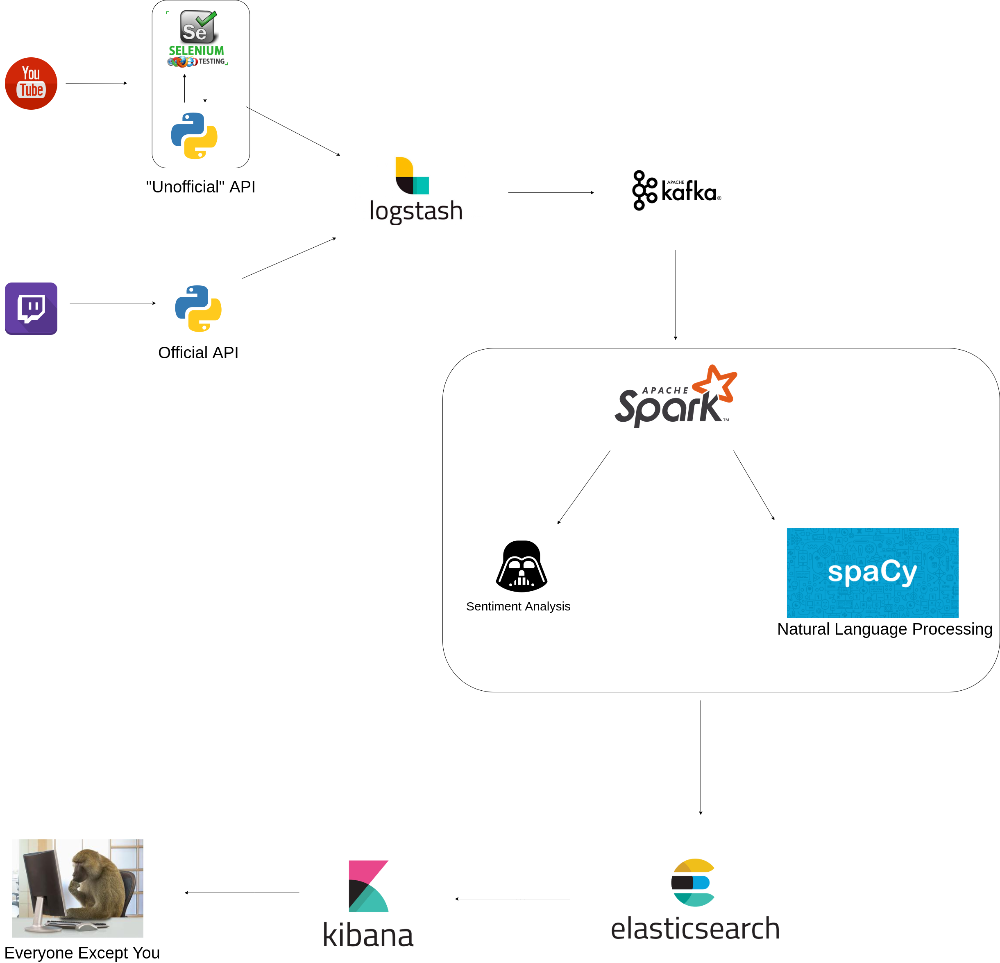

# Multi-Stream-Live-Chat-Analysis

## What is it?

Twitch-Youtube-Chat-Analysis is a university project made by the student Incardona Biagio for the **TECHNOLOGIES FOR ADVANCED PROGRAMMING** course.
The project consists of real-time analysis of the viewers interactions on a live stream on YouTube and / or Twitch.

## Who?

The project is aimed to streamers and potential investors who want analyze a channel before spending their money.

## Goal

The main goal is to have a simply interface to analyze the viewers behavior as the chats in a live stream can be really confusing.
That issue became worse if parallel streams in different platforms are made


A dashboard will then be provided containing the main analysis with the possibility of:
  1. Having a summary analysis concerning all the platforms simultaneously
  2. Having an analysis aimed at the single platform

## Used technologies
  * Virtualization : Docker
  * Ingestion : Logstash + Scraping + API
    1. Scraping : Selenium
  * Streaming : Apache Kafka
  * Processing : Apache Spark
  * Natural Language Processing : SpaCy
  * Sentiment analysis : Vader
  * Indexing : ElasticSearch
  * Visualization : Kibana
  
## General Schema

<p align="center">
  
</p>
  
# Use

## Requirements

Docker is required for correct running, the rest of dependencies and necessary files will be automatically added at first start.

## Guide

***First, move into the project directory***

#### 1. First start (Or if you had deleted the docker images)
If this is the first time you are running the project (or your docker images have been deleted) run the following script, then go to step 2.

```shell

$ ./build.sh

```
NOTE: This step may take a long time depending on the internet connection available

#### 2. Start

To run the project you just need to run this script 

```shell

$ ./start.sh [-t "lowcase, Twitch channel name"] [-y "YouTube stream id*"] 

```
To get the YouTube stream you have to copy the last part of the link

ies.

link : https://www.youtube.com/watch?v=US6iyJKGNLI

stream id : **US6iyJKGNLI**

Both the parameters -t and -y are optional (at least one have to be present) and could be swapped

#### Stop

To stop the project you just need to run this script. All containers will be stoppend and deleted 

```shell

$ ./stop.sh

```
